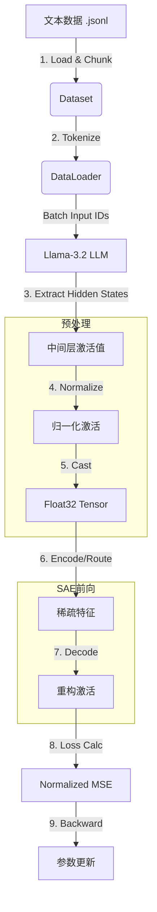
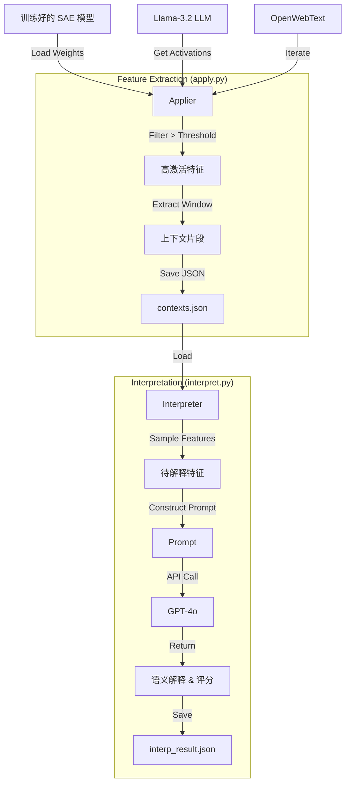

# RouteSAE-repro 项目完整代码深度解析

本文档对 RouteSAE-repro 项目进行极其详尽的代码解析。不仅涵盖整体流程，还对每个核心类、方法、参数进行了逐行拆解和原理解释。文档结构严格遵循项目模块划分。

---

## 目录

1. [项目结构](#项目结构)
2. [数据流总览](#数据流总览)
3. [model.py 详解](#modelpy-详解)
4. [data.py 详解](#datapy-详解)
5. [utils.py 详解](#utilspy-详解)
6. [trainer.py 详解](#trainerpy-详解)
7. [evaluator.py 详解](#evaluatorpy-详解)
8. [applier.py 详解](#applierpy-详解)
9. [interpreter.py 详解](#interpreterpy-详解)
10. [训练流程](#训练流程)
11. [评估流程](#评估流程)
12. [应用流程 (Feature Extraction)](#应用流程-feature-extraction)
13. [解释流程 (Interpretation)](#解释流程-interpretation)

---

## 项目结构

```text
RouteSAE-repro/
├── src/
│   ├── __init__.py       # 包初始化
│   ├── model.py          # [Core] SAE 模型定义 (TopK, RouteSAE)
│   ├── data.py           # [Core] 数据加载与流式处理
│   ├── utils.py          # [Core] 通用工具库 (最为关键)
│   ├── applier.py        # [Analysis] 特征提取器
│   ├── trainer.py        # [Flow] 训练控制器
│   ├── evaluator.py      # [Flow] 评估控制器
│   └── interpreter.py    # [Analysis] 特征解释接口
├── scripts/
│   ├── env_setup.sh      # 环境变量配置
│   ├── download_data.sh  # 数据下载工具
│   ├── download_model.sh # 模型下载工具
│   ├── train_topk.sh     # TopK 训练入口脚本
│   ├── train_vanilla.sh  # [New] Vanilla SAE 训练入口
│   ├── train_gated.sh    # [New] Gated SAE 训练入口
│   ├── train_jumprelu.sh # [New] JumpReLU SAE 训练入口
│   ├── train_crosscoder.sh # [New] Crosscoder SAE 训练入口
│   ├── train_routesae.sh # RouteSAE 训练入口脚本
│   ├── evaluate_compare.sh # 评估对比入口脚本
│   ├── apply.sh          # 特征提取入口脚本
│   └── interpret.sh      # 特征解释入口脚本
├── train.py              # Python 训练主入口
├── evaluate.py           # Python 评估主入口
├── apply.py              # Python 特征提取入口
├── interpret.py          # Python 特征解释入口
└── requirements.txt      # 依赖包列表
```

---

## 数据流总览

### 1. 核心训练数据流



### 2. 特征提取与解释流



---

## model.py 详解

本模块定义了所有的神经网络架构。

### 1. TopK 类详解

**定位**：标准的单层稀疏自编码器。

#### 1.1 初始化 `__init__`

```python
class TopK(nn.Module):
    def __init__(self, hidden_size: int, latent_size: int, k: int):
        super().__init__()
        self.k = k
        self.hidden_size = hidden_size
        self.latent_size = latent_size
        
        # [关键参数说明]
        # pre_bias: 编码前消去均值，解码后加回。使模型只需拟合残差。
        self.pre_bias = nn.Parameter(torch.zeros(hidden_size))
        
        # latent_bias: 控制 Latent 激活的门槛。
        # 正值 -> 易激活; 负值 -> 难激活 (死神经元)
        self.latent_bias = nn.Parameter(torch.zeros(latent_size))
        
        # 权重矩阵 (无 Bias, 因为 Bias 单独定义了)
        self.encoder = nn.Linear(hidden_size, latent_size, bias=False)
        self.decoder = nn.Linear(latent_size, hidden_size, bias=False)
        
        # 初始化策略: 
        # PyTorch 默认初始化通常足够，但部分 SAE 论文建议 Decoder = Encoder.T
        # 这里使用默认初始化，但在训练代码中会做 Unit Norm 约束
```

#### 1.2 预激活 `pre_acts`

```python
    def pre_acts(self, x: torch.Tensor) -> torch.Tensor:
        # 1. 去中心化: (x - b_pre)
        # 2. 线性投影: @ W_enc
        # 3. 加偏置: + b_latent
        return self.encoder(x - self.pre_bias) + self.latent_bias
```

#### 1.3 编码与稀疏化 `encode`

```python
    def encode(self, x, infer_k=None, theta=None):
        # 计算预激活值
        pre_acts = self.encoder(x - self.pre_bias) + self.latent_bias
        
        # [稀疏化逻辑]
        # 训练时: infer_k=None, 使用 self.k (如 64)
        # 推理时: 可指定 infer_k 或 theta (阈值截断)
        latents = topk_sparsify(pre_acts, k=infer_k or self.k)
        
        return latents
```

#### 1.4 解码 `decode`

```python
    def decode(self, latents: torch.Tensor) -> torch.Tensor:
        # 线性解码 + 恢复中心
        return self.decoder(latents) + self.pre_bias
```

---

### 2. RouteSAE 类详解

**定位**：多层共享、动态路由的 SAE。

#### 2.1 初始化 `__init__`

```python
class RouteSAE(nn.Module):
    def __init__(self, hidden_size, n_layers, latent_size, k):
        super().__init__()
        # 定义路由范围: Llama-3.2-1B (16层) -> 关注 Layer 4 到 12
        self.start_layer = n_layers // 4
        self.end_layer = n_layers * 3 // 4 + 1
        self.n_routed_layers = self.end_layer - self.start_layer
        
        # Router 网络:
        # 输入: hidden_size (2048)
        # 输出: 每一层的权重 logits (9个值)
        self.router = nn.Linear(hidden_size, self.n_routed_layers, bias=False)
        
        # 共享 SAE: 所有层共用这一套 Encoder/Decoder
        self.sae = TopK(hidden_size, latent_size, k)
```

#### 2.2 路由计算 `get_router_weights`

```python
    def get_router_weights(self, x, aggre):
        # x shape: [batch, seq, n_layers, hidden]
        
        # 1. 聚合多层特征
        if aggre == 'sum':
            router_input = x.sum(dim=2)
        elif aggre == 'mean':
            router_input = x.mean(dim=2)
            
        # 2. 计算 Logits
        logits = self.router(router_input)
        
        # 3. Softmax 归一化为概率
        weights = F.softmax(logits, dim=-1)
        return weights
```

#### 2.3 执行路由 `route` (核心)

```python
    def route(self, x, router_weights, routing):
        if routing == 'hard':
            # === 硬路由 ===
            # 每个 Token 只选择置信度最高的那一层
            # max_weights: [batch, seq]
            # target_layers: [batch, seq] (值为 0~8)
            max_weights, target_layers = router_weights.max(dim=-1)
            
            # 使用 gather 提取对应层的数据
            # indices 需要扩充维度以匹配 x
            indices = target_layers.unsqueeze(-1).unsqueeze(-1).expand(-1, -1, -1, x.size(-1))
            routed_x = torch.gather(x, 2, indices).squeeze(2)
            
            # 梯度直通 (Straight-Through Estimator 思想):
            # 虽然 gather 操作不可导(对于索引)，但我们乘以了 max_weights
            # 使得梯度可以回传给 Router
            routed_x = routed_x * max_weights.unsqueeze(-1)
            
            # 记录 One-Hot 权重供 Hook 使用
            layer_weights = F.one_hot(target_layers, num_classes=self.n_routed_layers)
            
        elif routing == 'soft':
            # === 软路由 ===
            # 加权求和所有层
            weights_expanded = router_weights.unsqueeze(-1)
            routed_x = (x * weights_expanded).sum(dim=2)
            layer_weights = router_weights
            
        return layer_weights, routed_x

---

### 3. [New] 其它 SAE 变体详解

本节展示新增模型的完整实现代码与深度解析，格式上与 TopK/RouteSAE 保持一致。

#### 3.1 Vanilla SAE 类详解
**定位**：传统 SAE，使用 ReLU + L1 正则化。
**特点**：基准模型，但存在 L1 Shrinkage 问题。

##### 3.1.1 初始化 `__init__`
```python
class Vanilla(nn.Module):
    def __init__(self, hidden_size: int, latent_size: int) -> None:
        super(Vanilla, self).__init__()
        # 偏置项: pre_bias (去中心化), latent_bias (激活阈值)
        self.pre_bias = nn.Parameter(torch.zeros(hidden_size))
        self.latent_bias = nn.Parameter(torch.zeros(latent_size))
        
        # 编码器与解码器
        self.encoder = nn.Linear(hidden_size, latent_size, bias=False)
        self.decoder = nn.Linear(latent_size, hidden_size, bias=False)
        self._initialize_weights() # Decoder = Encoder.T
```

##### 3.1.2 前向传播 `forward`
```python
    def forward(self, x: torch.Tensor, infer_k=None, theta=None) -> Tuple[torch.Tensor, torch.Tensor]:
        # 1. 预激活: Encoder(x - b_pre) + b_latent
        pre_acts = self.encoder(x - self.pre_bias) + self.latent_bias
        
        # 2. 激活函数: 直接使用 ReLU
        # 这是与 TopK 的核心区别 (TopK 使用 selection)
        latents = F.relu(pre_acts)
        
        # 3. 稀疏化干预 (仅推理时生效，用于强制稀疏化)
        if theta is not None:
             latents = torch.where(latents > theta, latents, torch.zeros_like(latents))
        elif infer_k is not None:
            # 即使训练用 ReLU，推理时也可以强制 TopK
            topk_values, topk_indices = torch.topk(latents, infer_k, dim=-1)
            latents = torch.zeros_like(latents).scatter_(-1, topk_indices, topk_values)

        # 4. 解码重构
        x_hat = self.decoder(latents) + self.pre_bias
        return latents, x_hat
```

---

#### 3.2 Gated SAE 类详解
**定位**：Gated Linear SAE，分离“是否激活”与“幅值大小”。

##### 3.2.1 初始化 `__init__`
```python
class Gated(nn.Module):
    def __init__(self, hidden_size: int, latent_size: int) -> None:
        super(Gated, self).__init__()
        self.pre_bias = nn.Parameter(torch.zeros(hidden_size))
        
        # Gate 路径专用参数
        self.gate_bias = nn.Parameter(torch.zeros(latent_size))
        
        # Magnitude 路径专用参数
        self.mag_bias = nn.Parameter(torch.zeros(latent_size))
        self.r_mag = nn.Parameter(torch.zeros(latent_size))  # 幅度缩放系数
        
        # 共享权重: Gate 和 Mag 路径共用同一个 Linear 投影
        # 这种设计比完全分离的两个 Encoder 参数量更小
        self.encoder = nn.Linear(hidden_size, latent_size, bias=False)
        self.decoder = nn.Linear(latent_size, hidden_size, bias=False)
```

##### 3.2.2 前向传播 `forward`
```python
    def forward(self, x: torch.Tensor, ...) -> Tuple[torch.Tensor, torch.Tensor]:
        # 1. 基础投影 (不加 bias)
        pre_acts = self.encoder(x - self.pre_bias)
        
        # 2. Gate 路径: 决定是否激活
        # Heaviside Step Function: (x > 0) ? 1 : 0
        pi_gate = pre_acts + self.gate_bias
        f_gate = (pi_gate > 0).float() 
        
        # 3. Magnitude 路径: 决定激活值大小
        # f_mag = ReLU(exp(r_mag) * pre_acts + mag_bias)
        # 注意: 这里不需要 L1 正则约束，因为稀疏性由 Gate 负责
        pi_mag = torch.exp(self.r_mag) * pre_acts + self.mag_bias
        f_mag = F.relu(pi_mag)
        
        # 4. 组合输出
        latents = f_gate * f_mag
        
        x_hat = self.decoder(latents) + self.pre_bias
        return latents, x_hat
```

---

#### 3.3 JumpReLU SAE 类详解
**定位**：使用可学习阈值的阶跃函数代替 ReLU。

##### 3.3.1 自定义 Autograd `Jump_func`
这是 JumpReLU 的核心。因为阶跃函数 (Step Function) 不可导，我们必须手动定义反向传播行为。
```python
class Jump_func(autograd.Function):
    @staticmethod
    def forward(ctx, x, threshold, bandwidth):
        ctx.save_for_backward(x, threshold)
        ctx.bandwidth = bandwidth
        # 前向: 硬截断
        return x * (x > threshold).float()
    
    @staticmethod
    def backward(ctx, grad_output):
        x, threshold = ctx.saved_tensors
        bandwidth = ctx.bandwidth
        
        # 1. x 的梯度: 激活区为 1，非激活区为 0 (直通)
        x_grad = (x > threshold).float() * grad_output
        
        # 2. threshold 的梯度: 
        # 使用矩形核 (Box Kernel) 近似 Dirac Delta 函数
        # 使得阈值参数可以接收到来自重建误差的梯度信号并进行更新
        in_bandwidth = (x - threshold).abs() < bandwidth / 2
        threshold_grad = -(threshold / bandwidth) * in_bandwidth.float() * grad_output
        
        return x_grad, threshold_grad, None
```

##### 3.3.2 模块实现 `JumpReLU`
```python
class JumpReLU(nn.Module):
    def __init__(self, hidden_size, latent_size, threshold=1e-3, bandwidth=1e-3):
        # ... 初始化 ...
        # [关键] 每个特征独立的可学习阈值
        self.threshold = nn.Parameter(torch.full((latent_size,), threshold))
        self.bandwidth = bandwidth

    def forward(self, x, infer_k=None, theta=None):
        pre_acts = self.encoder(x - self.pre_bias) + self.latent_bias
        
        if self.training and infer_k is None:
            # 训练阶段: 调用自定义 Function 以获得梯度
            latents = Jump_func.apply(pre_acts, self.threshold, self.bandwidth)
        else:
            # 推理阶段: 直接硬截断，速度更快
            mask = (pre_acts > self.threshold).float()
            latents = pre_acts * mask
            
        x_hat = self.decoder(latents) + self.pre_bias
        return latents, x_hat
```

---

#### 3.4 Crosscoder SAE 类详解
**定位**：跨层稀疏自动编码器，也是本项目最高级的变体之一。

##### 3.4.1 初始化 `__init__`
```python
class Crosscoder(nn.Module):
    def __init__(self, hidden_size, n_layers, latent_size):
        super().__init__()
        # 定义处理范围: 如 Layer 4-12
        self.start_layer = n_layers // 4
        self.end_layer = n_layers * 3 // 4 + 1
        self.n_processed_layers = self.end_layer - self.start_layer
        
        # [关键结构] 多头编码器 & 多头解码器
        # 我们不是处理单个向量，而是处理 [Layer 4, Layer 5, ..., Layer 12] 这一组向量
        # 每个 Layer 都有自己独立的 Projection 矩阵
        self.encoder = nn.ModuleList([
            nn.Linear(hidden_size, latent_size, bias=False) 
            for _ in range(self.n_processed_layers)
        ])
        self.decoder = nn.ModuleList([
            nn.Linear(latent_size, hidden_size, bias=False) 
            for _ in range(self.n_processed_layers)
        ])
        
        # 共享 Latent Bias (说明所有层共用一个语义空间)
        self.latent_bias = nn.Parameter(torch.zeros(latent_size))
```

##### 3.4.2 跨层编码 `pre_acts`
```python
    def pre_acts(self, x: torch.Tensor) -> torch.Tensor:
        # x shape: [batch, seq, n_processed_layers, hidden]
        
        # 1. 分层独立投影
        pre_acts = torch.zeros(..., self.latent_size, ...)
        for i in range(self.n_processed_layers):
            pre_acts[:, :, i, :] = self.encoder[i](x[:, :, i, :])
        
        # 2. 跨层求和 (Reduction)
        # 将来自 Layer 4 的信息 + Layer 5 的信息 + ... 融合
        # 这一步实现了 "Cross-Layer" 信息交互
        summed_pre_acts = pre_acts.sum(dim=2) + self.latent_bias
        return summed_pre_acts
```

##### 3.4.3 分层解码 `decode`
```python
    def decode(self, latents: torch.Tensor) -> torch.Tensor:
        # 将融合后的 Latent (稀疏语义) 还原回各个层的具体表达
        # 例如: "Paris" 这个概念在 Layer 4 和 Layer 12 的向量表示可能不同
        x_hat = torch.zeros(..., self.n_processed_layers, self.hidden_size)
        for i in range(self.n_processed_layers):
            x_hat[:, :, i, :] = self.decoder[i](latents)
        return x_hat
```
```

---

## data.py 详解

负责处理 OpenWebText 数据集。

### 1. OpenWebTextDataset 类

#### 1.1 数据读取 `__init__`

```python
class OpenWebTextDataset(Dataset):
    def __init__(self, folder_path, tokenizer, max_length, max_samples=None):
        self.data = []
        # ... 遍历文件 ...
        with open(filepath, 'r') as f:
            for line in f:
                # 逐行读取 JSONL
                record = json.loads(line)
                text = record['text']
                
                # [关键策略: 按词分块]
                # 传统方法直接截断 tokens，可能导致单词语义不完整
                # 这里先按空格分词，每 max_length 个词组成一段
                words = text.split()
                for i in range(0, len(words), max_length):
                    chunk = ' '.join(words[i:i + max_length])
                    
                    # Tokenize
                    inputs = tokenizer(
                        chunk,
                        return_tensors='pt',
                        max_length=max_length,
                        padding='max_length',
                        truncation=True
                    )
                    self.data.append((inputs['input_ids'], inputs['attention_mask']))
```

### 2. DataLoader 创建 `create_dataloader`

```python
def create_dataloader(folder_path, tokenizer, batch_size, max_length, ...):
    dataset = OpenWebTextDataset(...)
    
    # 自定义 collate_fn 将 list 转为 tensor
    def collate_fn(batch):
        input_ids = torch.stack([item[0] for item in batch])
        attention_mask = torch.stack([item[1] for item in batch])
        return input_ids, attention_mask
        
    return DataLoader(dataset, batch_size=batch_size, collate_fn=collate_fn)
```

---

## utils.py 详解

这是项目的“瑞士军刀”，包含所有底层逻辑。

### 1. 模型加载 `get_language_model`

```python
def get_language_model(model_path, device):
    # 这里开启 output_hidden_states=True 是必须的
    # 否则 LLM 前向传播不会返回中间层的激活值
    language_model = AutoModelForCausalLM.from_pretrained(
        model_path, 
        output_hidden_states=True
    ).to(device)
    # 冻结参数，只用于提取特征
    for param in language_model.parameters():
        param.requires_grad = False
    return tokenizer, language_model
```

### 2. 激活提取 `get_outputs`

```python
def get_outputs(cfg, batch, language_model, device):
    # 无梯度前向传播
    with torch.no_grad():
        outputs = language_model(input_ids, attention_mask)
    
    if cfg.model in ['TopK', 'Vanilla', 'Gated', 'JumpReLU']:
        # 提取单层
        hidden_states = outputs.hidden_states[cfg.layer]
        
    elif cfg.model in ['RouteSAE', 'MLSAE', 'Crosscoder']:
        # 提取多层范围 (start_layer 到 end_layer)
        # stack 后维度: [layers, batch, seq, hidden]
        hidden_states = torch.stack(outputs.hidden_states[start:end])
        # permute 调整为: [batch, seq, layers, hidden]
        hidden_states = hidden_states.permute(1, 2, 0, 3)
        
    return input_ids, attention_mask, outputs, hidden_states
```

### 3. 数据预处理 `pre_process` (核心修复)

```python
def pre_process(hidden_states, eps=1e-6):
    """
    功能: Zero-Mean Unit-Variance 归一化
    输入: BFloat16 / Float32 Tensor
    输出: Float32 Tensor
    """
    # 1. 计算统计量 (在 hidden 维度)
    mean = hidden_states.mean(dim=-1, keepdim=True)
    std = hidden_states.std(dim=-1, keepdim=True)
    
    # 2. 归一化公式
    x = (hidden_states - mean) / (std + eps)
    
    # 3. 返回统计量以便后续恢复
    return x, mean, std
```

### 4. 损失函数 `Normalized_MSE_loss`

```python
def Normalized_MSE_loss(x, x_hat):
    # MSE: 逐元素平方差均值
    mse = ((x_hat - x) ** 2).mean(dim=-1)
    
    # Variance: 原始激活的方差 (即能量)
    variance = (x ** 2).mean(dim=-1)
    
    # Normalized MSE: 消除输入幅度影响，关注相对误差
    return (mse / variance).mean()
```

### 5. 解码器约束 `unit_norm_decoder`

```python
def unit_norm_decoder(model):
    # 强制 Decoder 权重的每一列 (对应一个特征) 的 L2 范数为 1
    # 否则 SAE 可能通过放大 Decoder 权重、缩小 Encoder 权重来"作弊"
    # 或者某些特征逐渐趋近于 0 (Dead Features)
    W = model.decoder.weight.data
    model.decoder.weight.data = W / W.norm(dim=0, keepdim=True)
```

### 6. Hook 机制 `hook_SAE`

```python
def hook_SAE(cfg, model, hooked_module, ...):
    def hook(module, _, outputs):
        # 1. 保存这个 Batch 的原始数据类型 (通常是 bfloat16)
        original_dtype = outputs[0].dtype 
        
        # 2. 预处理并转为 float32 (SAE 需要高精度)
        x, mu, std = pre_process(outputs[0])
        x = x.float()
        
        # 3. SAE 重构
        latents = model.encode(x)
        x_hat = model.decode(latents)
        
        # 4. 反归一化: x_hat * std + mu
        # 5. 还原类型: .to(original_dtype)
        reconstruct = (x_hat * std + mu).to(original_dtype)
        
        # 6. 替换原始输出
        outputs[0] = reconstruct
        return outputs
        
    return [hooked_module.register_forward_hook(hook)]
```

### 7. RouteSAE Hook `hook_RouteSAE`

```python
def hook_RouteSAE(cfg, model, language_model, batch_layer_weights, ...):
    handles = []
    # 遍历每一层 (比如 Layer 4, 5, ..., 12)
    for layer_idx in range(...):
        def hook(module, _, outputs):
            # ... (前处理同 hook_SAE) ...
            
            # [关键差异]
            # 只有当 Router 选择了这一层时，才进行替换
            # batch_layer_weights: [B, S, n_layers] (One-Hot)
            layer_mask = batch_layer_weights[:, :, layer_idx].bool()
            
            if layer_mask.any():
                # 计算重构...
                
                # 仅在 mask 为 True 的位置替换
                outputs[0][layer_mask] = reconstruct[layer_mask]
            
            return outputs
        
        handles.append(register_hook(...))
    return handles
```

---

## trainer.py 详解

### 核心训练循环 `Trainer.run`

```python
    def run(self):
        # 初始时先做一次归一化
        unit_norm_decoder(self.model)
        
        for epoch in range(self.cfg.num_epochs):
            for batch in self.dataloader:
                
                # 1. 提取 LLM 激活 (No Grad)
                _, _, _, hidden_states = get_outputs(...)
                
                # 2. 显式类型转换 (BF16 -> FP32)
                x, _, _ = pre_process(hidden_states)
                x = x.float() 
                
                # 3. SAE 前向
                if self.cfg.model == 'RouteSAE':
                    # input: 被路由选中的原始特征
                    # output: SAE 重构特征
                    _, x_input, _, x_hat, _ = self.model(x, ...)
                else:
                    _, x_hat = self.model(x)
                    x_input = x
                
                # 4. 计算损失
                if self.cfg.model == 'Crosscoder':
                    # Crosscoder Loss = MSE + Recons + L1 * L1_Coeff
                    # 注意: Crosscoder 的 latents 是 [batch, seq, latent], L1 Loss 对其求平均
                    mse_loss = Normalized_MSE_loss(x, x_hat)
                    l1_loss = latents.abs().mean()
                    loss = mse_loss + self.cfg.l1_coeff * l1_loss
                else:
                    # 标准 SAE (TopK/RouteSAE)
                    # RouteSAE 可能包含额外的 router loss，但在 run() 中统一封装了
                    # TopK 只有 MSE (由 L0 约束稀疏性)
                    # Vanilla/Gated 可能也需要加 L1，视具体实现而定
                    loss = Normalized_MSE_loss(x_input, x_hat)
                
                # 5. 反向传播
                self.optimizer.zero_grad()
                loss.backward()
                self.optimizer.step()
                
                # 6. 周期性约束
                if step % self.cfg.steps == 0:
                    unit_norm_decoder(self.model)
```

---

## evaluator.py 详解

### 评估指标实现

#### 1. NormMSE (重构质量)

```python
    loss = Normalized_MSE_loss(x, x_hat)
    # 直接反映 SAE 还原原始信号的能力
```

#### 2. KL Divergence (功能保持)

```python
    # 步骤 1: 原始 LLM 前向
    logits_original = language_model(input_ids).logits
    
    # 步骤 2: 计算路由权重 (仅 RouteSAE 需要)
    if RouteSAE:
        route_weights = model(x)[0]
    
    # 步骤 3: 注入 Hook
    # Hook 会在 LLM 运行到中间层时，强制把激活值替换为 SAE 的重构值
    # 注意: RouteSAE Hook 较复杂，涉及多层 gather/scatter
    # 目前 Crosscoder 暂不支持 KLDiv 评估 (因为涉及跨层同时干预，实现更复杂)
    handles = hook_RouteSAE(..., route_weights)
    
    # 步骤 4: 干预后的 LLM 前向
    logits_reconstruct = language_model(input_ids).logits
    
    # 步骤 5: 计算分布差异 (KL 散度)
    loss = F.kl_div(
        F.log_softmax(logits_reconstruct), 
        F.softmax(logits_original)
    )
    
    # 步骤 6: 清理 Hook
    for h in handles: h.remove()
```

---

## applier.py 详解

负责处理数据并提取 SAE 激活特征及其上下文。这一步是特征解释的前置步骤。

### 1. Applier 类详解

#### 1.1 初始化 `__init__`

```python
class Applier:
    def __init__(self, cfg):
        self.cfg = cfg
        self.device = torch.device(cfg.device)
        
        # 1. 初始化模型结构 (TopK 或 RouteSAE)
        self.model = get_model(cfg.model, ...)

        # 2. 加载预训练 SAE 权重
        state_dict = torch.load(cfg.SAE_path, map_location=self.device)
        self.model.load_state_dict(state_dict)
        self.model.to(self.device)
        self.model.eval()
        
        # 3. 延迟加载 LLM (get_context 时才加载)
        self.tokenizer = None
        self.language_model = None
```

#### 1.2 上下文提取 `get_context`

```python
    def get_context(self, threshold=10.0, max_length=64, ...):
        # 1. 加载 LLM 和数据
        if self.language_model is None:
             self.tokenizer, self.language_model = get_language_model(...)
             
        dataloader = create_dataloader(...)
        
        # 2. 存储结构: latent_idx -> token_class -> heap
        latent_context_map = defaultdict(lambda: defaultdict(list))
        
        # 定义辅助函数: find_sentence_bounds, process_and_store_context
        
        for batch in tqdm(dataloader):
            # 获取 LLM 隐藏层状态
            _, _, _, hidden_states = get_outputs(...)
            
            # 预处理 (归一化)
            x, _, _ = pre_process(hidden_states)
            
            # [关键] 数据类型对齐: 确保 x 的 dtype 与 model 一致
            model_dtype = next(self.model.parameters()).dtype
            x = x.to(dtype=model_dtype)
            
            # SAE 前向
            if RouteSAE:
                _, _, latents, _, _ = self.model(x, ...)
            else:
                latents, _ = self.model(x, ...)
            
            # 找到激活 > threshold 的位置
            positions = (latents > threshold)
            
            # 遍历 Batch 提取上下文
            for i in range(batch_size):
                activated_indices = torch.nonzero(positions[i], as_tuple=False)
                for idx in activated_indices:
                    seq_pos, latent_dim = idx[0].item(), idx[1].item()
                    activation_value = latents[i, seq_pos, latent_dim].item()
                    
                    # 调用辅助函数处理并存储
                    process_and_store_context(latent_dim, seq_pos, activation_value, tokens)
                
        # 3. 结果整理与过滤
        # ... (按 lines 过滤，按 activation 排序) ...
        
        save_json(output_data, output_path)
        return total_latents, output_path
```

---

## interpreter.py 详解

负责将提取出的特征上下文发送给 GPT-4 进行自动解释。

### 1. Interpreter 类详解

#### 1.1 核心逻辑 `run`

```python
class Interpreter:
    def run(self, data_path, sample_latents=100, ...):
        # 1. 加载上下文数据
        with open(data_path, 'r') as f:
            data = json.load(f)
            
        # 2. 随机采样特征
        latent_context_map = data.get('latent_context_map', {})
        all_latents = list(latent_context_map.keys())
        sampled_indices = random.sample(range(len(all_latents)), sample_size)
        sampled_latents = [all_latents[i] for i in sorted(sampled_indices)]
        
        # 3. 初始化 OpenAI 客户端 (支持 OpenAI / AzureOpenAI)
        api_key = self.cfg.api_key or os.environ.get("OPENAI_API_KEY")
        if self.cfg.api_base:
            client = AzureOpenAI(...) 
        else:
            client = OpenAI(...)      
            
        # 4. 循环调用 API
        for idx, latent in enumerate(sampled_latents, 1):
            # 获取该特征的所有上下文 tokens_info
            
            # [关键] 限制 Prompt 大小: 随机采样最多 20 个上下文
            if len(tokens_info) > 20:
                random.shuffle(tokens_info)
                tokens_info = tokens_info[:20]

            prompt = self.construct_prompt(tokens_info)
            
            try:
                # [速率限制] 避免 TPM 溢出
                time.sleep(2) 
                response = self.chat_completion(client, prompt)
                
                # 解析并存储结果
                # ...
                
            except Exception as e:
                logger.error(...)
                continue
            
        # 5. 保存结果
        save_json(output_data, output_path)
        return avg_score, ...
```

#### 1.2 API 调用与重试 `chat_completion`

```python
    def chat_completion(self, client, prompt, max_retry=3):
        for attempt in range(1, max_retry + 1):
            try:
                chat_completion = client.chat.completions.create(
                    messages=[...],
                    model=self.cfg.engine,
                    max_tokens=128,  
                    temperature=0.1,
                )
                return response_content
            except Exception as e:
                # 记录警告并重试
                if attempt == max_retry: raise
```

---

## 训练流程

本节详细拆解训练一个高质量 SAE 模型的完整步骤及调参指南。

### 1. 环境与数据准备
1.  **环境配置**:
    ```bash
    source scripts/env_setup.sh
    # 关键变量:
    # HF_HOME: 模型缓存路径
    # CUDA_VISIBLE_DEVICES: 指定显卡
    ```
2.  **数据下载**:
    ```bash
    bash scripts/download_data.sh
    ```
    *   **产物**: `train.jsonl` (每一行是一个 JSON 对象，包含 `text` 字段)。
    *   **注意**: 即使是 10万样本，也足够训练一个不错的 SAE 用于实验。

### 2. 启动训练

以 `RouteSAE` 为例 (通用命令):
```bash
bash scripts/train_routesae.sh
```

**关键参数详解 (`train.py` arguments)**:
*   `--model`: 选择模型架构 (TopK, RouteSAE, Crosscoder, etc.)。
*   `--l1_coeff`: **[核心超参]** L1 正则化系数 (针对 Vanilla/Crosscoder)。
    *   **过大 (>1e-3)**: 导致 "Feature Collapse"，所有 Latents 输出为 0，Loss 停留在 1.0 附近。
    *   **过小 (<1e-5)**: 导致 L0 (非零元数量) 激增，丧失稀疏性，失去可解释性。
    *   **推荐值**: 2e-4 ~ 5e-4。
*   `--lr`: 学习率。通常 5e-4 到 1e-3 较为稳定。
*   `--batch_size`: 显存允许的情况下越大越好 (64/128)。Crosscoder 需调小至 32/64。

### 3. 监控与排错 (Troubleshooting)

*   **现象 A: Loss 不下降 (一直 > 0.9)**
    *   **原因**: L1 系数太大，或学习率太低，或模型初始化不当 (Dead Neurons)。
    *   **对策**: 减小 `l1_coeff`，检查 `unit_norm_decoder` 是否生效。
*   **现象 B: OOM (CUDA Out of Memory)**
    *   **原因**: Crosscoder/RouteSAE 需同时存储多层激活。
    *   **对策**: 减小 `batch_size` (128 -> 64 -> 32)。
*   **现象 C: L0 这里程碑式下降**
    *   **正常**: 训练初期 L0 很高，随着 L1 惩罚生效，L0 会逐渐收敛到目标值 (如 20-100)。

---

## 评估流程

评估是验证 SAE 是否“既稀疏又保真”的关键环节。

### 1. 启动评估
```bash
bash scripts/evaluate_compare.sh
```
该脚本会自动对比 8 种模型，核心是运行两次 `evaluate.py`。

### 2. Phase 1: 重构质量评估 (NormMSE)
*   **命令**: `python evaluate.py --metric NormMSE ...`
*   **指标定义**: 
    $$ NormMSE = \frac{||x - \hat{x}||^2}{||x||^2} $$
*   **解读**:
    *   **< 0.1**: 极其完美 (可能过拟合或 L0 很高)。
    *   **0.1 ~ 0.3**: **优秀**。大多数高质量 SAE 处于此范围。
    *   **0.3 ~ 0.6**: **一般**。能捕捉主要特征，但丢失细节。
    *   **> 0.8**: **失败**。模型未能有效学习。

### 3. Phase 2: 下游影响评估 (KL Divergence)
*   **命令**: `python evaluate.py --metric KLDiv ...`
*   **流程**:
    1.  运行 LLM 得到原始 Logits $P$。
    2.  Hook 中间层，用 SAE 重构值 $\hat{x}$ 替换真实激活 $x$。
    3.  继续运行 LLM 得到干预后的 Logits $Q$。
    4.  计算 $D_{KL}(P || Q)$。
*   **解读**: 越低越好。表示 SAE 的替换没有改变 LLM 原本的预测结果，即 SAE 完美捕捉了对下游任务有用的语义信息。

---

## 应用流程 (Feature Extraction)

此步骤将“数学上的稀疏向量”转化为“人类可读的文本案例”。

### 1. 运行提取
```bash
bash scripts/apply.sh
```

### 2. 核心逻辑 (data flow)
1.  **加载模型**: 读取 `RouteSAE_openwebtext2.pt`。
2.  **全量扫描**: 遍历 OpenWebText 数据集 (如 10万条)。
3.  **激活筛选**:
    *   对于每个 Latent Dimension (0~16383):
    *   记录激活值 > `threshold` (默认 10.0) 的 Token 位置。
    *   截取该 Token 前后 64 个 Token 作为 Context。
4.  **去重与排序**: 保留激活值最高的 Top 20 个 Context。

### 3. 产物说明
生成 `contexts/RouteSAE_openwebtext2_contexts.json`，结构如下：
```json
{
  "latent_context_map": {
    "1245": {  // 特征 ID
      "activations": [25.4, 18.2, ...],
      "tokens": [
        ["The", "capital", "of", "France", "is", "Paris", ...], // 上下文 A
        ["Visited", "Paris", "last", "summer", ...]             // 上下文 B
      ]
    }
  }
}
```

---

## 解释流程 (Interpretation)

利用 GPT-4 的强大能力，从 Contexts 中归纳出特征的语义。

### 1. 运行解释
```bash
bash scripts/interpret.sh
```

### 2. Prompt 构建逻辑
系统会向 GPT-4 发送如下 Prompt (简化版):
> "I will provide a set of text snippets. In each snippet, a specific token is highly activated by a neuron using Max Act. Please identify the common theme or concept that this neuron is detecting.
> Examples: ...
> Snippets:
> 1. The capital of **France** is Paris...
> 2. Visited **Paris** last summer...
> Warning: If the snippets are unrelated, say 'Polysemantic'."

### 3. 结果产物
生成 `interpret/interp_RouteSAE_openwebtext2.json`:
```json
{
  "1245": {
    "description": "Tokens related to the city of Paris or France geography.",
    "similarity_score": 5, // 1-5 分，5 表示非常明确
    "polysemantic": false
  }
}
```
**结果分析**:
*   如果 Score 高且 description 清晰，说明 SAE 成功解离出了有意义的概念。
*   如果 Score 低或 polysemantic，说明该特征是“死神经元”或“多义神经元”。


---

## 附录：8大模型原理与对比

本项目实现了当前 SAE 领域主流的 8 种模型/变体，以下是它们的详细对比：

| 模型 | 核心机制 | 稀疏策略 | 适用场景 | 优点 | 缺点 |
| :--- | :--- | :--- | :--- | :--- | :--- |
| **TopK** | 标准 SAE | Top-K (强制保留 K 个最大值) | 单层特征分析 | 稀疏度可控 (L0=K)，无 L1 收缩问题 | 训练可能不稳定 (Dead Latents) |
| **Vanilla** | 传统 SAE | ReLU + L1 Regularization | 基准测试 | 实现简单，理论基础扎实 | 存在 L1 收缩 (Shrinkage)，幅度被低估 |
| **Gated** | Gated Linear SAE | Separation of Gate & Magnitude | 高精度特征提取 | 解决 L1 收缩问题，同时也学习稀疏性 | 参数量增加 (Gate+Mag)，训练较慢 |
| **JumpReLU**| JumpReLU SAE | Thresholding (Heaviside Step) | 高效特征提取 | 通过可学习阈值实现直接 L0 优化 | 梯度估计困难 (需要 STE) |
| **RouteSAE** | **Dynamic Routing** | Top-K + Layer Selection | **跨层/多层分析** | **能识别特征的层级归属**，减少计算量 | 结构复杂，需要训练 Router |
| **Crosscoder**| **Cross-Layer Encoding**| Shared Latent Space | **跨层特征融合** | **发现跨层共享特征**，参数效率高 | 显存消耗大 (同时处理多层) |
| **MLSAE** | Multi-Layer SAE | Parallel/Shared Processing | 多层基准 | 简单将多层视为 Batch | 忽略了层间相关性 |
| **RandomK** | Baseline | Random Top-K | 对照组 | 验证 SAE 是否真正学到了特征 | 性能应为下界 |

### 核心区别总结

1.  **单层 vs 多层**:
    *   **单层**: TopK, Vanilla, Gated, JumpReLU 通常针对某一特定层训练。
    *   **多层**: RouteSAE, Crosscoder, MLSAE 同时处理多个层。
        *   **RouteSAE**: "路由"思想，认为一个特征只属于某一层 (或少数层)。
        *   **Crosscoder**: "融合"思想，认为一个特征是由多层共同贡献的 (Shared Latent)。

2.  **激活函数进化**:
    *   **ReLU**: 最基础 (Vanilla)，但为了稀疏性需要 L1 正则，导致激活值偏小。
    *   **TopK**: 放弃 L1，直接限制数量，解决了幅度问题，但梯度难算。
    *   **Gated/JumpReLU**: 试图结合两者优点，既有稀疏性 (Gate/Threshold)，又有准确幅度。

