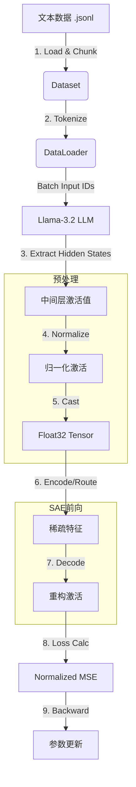

# RouteSAE-repro 项目完整代码深度解析

本文档对 RouteSAE-repro 项目进行极其详尽的代码解析。不仅涵盖整体流程，还对每个核心类、方法、参数进行了逐行拆解和原理解释。文档结构严格遵循项目模块划分。

---

## 目录

1. [项目结构](#项目结构)
2. [数据流总览](#数据流总览)
3. [model.py 详解](#modelpy-详解)
4. [data.py 详解](#datapy-详解)
5. [utils.py 详解](#utilspy-详解)
6. [trainer.py 详解](#trainerpy-详解)
7. [evaluator.py 详解](#evaluatorpy-详解)
8. [interpreter.py 详解](#interpreterpy-详解)
9. [训练流程](#训练流程)
10. [评估流程](#评估流程)

---

## 项目结构

```text
RouteSAE-repro/
├── src/
│   ├── __init__.py       # 包初始化
│   ├── model.py          # [Core] SAE 模型定义 (TopK, RouteSAE)
│   ├── data.py           # [Core] 数据加载与流式处理
│   ├── utils.py          # [Core] 通用工具库 (最为关键)
│   ├── trainer.py        # [Flow] 训练控制器
│   ├── evaluator.py      # [Flow] 评估控制器
│   └── interpreter.py    # [Analysis] 特征解释接口
├── scripts/
│   ├── env_setup.sh      # 环境变量配置
│   ├── download_data.sh  # 数据下载工具
│   ├── download_model.sh # 模型下载工具
│   ├── train_topk.sh     # TopK 训练入口脚本
│   ├── train_routesae.sh # RouteSAE 训练入口脚本
│   └── evaluate_compare.sh # 评估对比入口脚本
├── train.py              # Python 训练主入口
├── evaluate.py           # Python 评估主入口
└── requirements.txt      # 依赖包列表
```

---

## 数据流总览

### 核心训练数据流



---

## model.py 详解

本模块定义了所有的神经网络架构。

### 1. TopK 类详解

**定位**：标准的单层稀疏自编码器。

#### 1.1 初始化 `__init__`

```python
class TopK(nn.Module):
    def __init__(self, hidden_size: int, latent_size: int, k: int):
        super().__init__()
        self.k = k
        self.hidden_size = hidden_size
        self.latent_size = latent_size
        
        # [关键参数说明]
        # pre_bias: 编码前消去均值，解码后加回。使模型只需拟合残差。
        self.pre_bias = nn.Parameter(torch.zeros(hidden_size))
        
        # latent_bias: 控制 Latent 激活的门槛。
        # 正值 -> 易激活; 负值 -> 难激活 (死神经元)
        self.latent_bias = nn.Parameter(torch.zeros(latent_size))
        
        # 权重矩阵 (无 Bias, 因为 Bias 单独定义了)
        self.encoder = nn.Linear(hidden_size, latent_size, bias=False)
        self.decoder = nn.Linear(latent_size, hidden_size, bias=False)
        
        # 初始化策略: 
        # PyTorch 默认初始化通常足够，但部分 SAE 论文建议 Decoder = Encoder.T
        # 这里使用默认初始化，但在训练代码中会做 Unit Norm 约束
```

#### 1.2 预激活 `pre_acts`

```python
    def pre_acts(self, x: torch.Tensor) -> torch.Tensor:
        # 1. 去中心化: (x - b_pre)
        # 2. 线性投影: @ W_enc
        # 3. 加偏置: + b_latent
        return self.encoder(x - self.pre_bias) + self.latent_bias
```

#### 1.3 编码与稀疏化 `encode`

```python
    def encode(self, x, infer_k=None, theta=None):
        # 计算预激活值
        pre_acts = self.encoder(x - self.pre_bias) + self.latent_bias
        
        # [稀疏化逻辑]
        # 训练时: infer_k=None, 使用 self.k (如 64)
        # 推理时: 可指定 infer_k 或 theta (阈值截断)
        latents = topk_sparsify(pre_acts, k=infer_k or self.k)
        
        return latents
```

#### 1.4 解码 `decode`

```python
    def decode(self, latents: torch.Tensor) -> torch.Tensor:
        # 线性解码 + 恢复中心
        return self.decoder(latents) + self.pre_bias
```

---

### 2. RouteSAE 类详解

**定位**：多层共享、动态路由的 SAE。

#### 2.1 初始化 `__init__`

```python
class RouteSAE(nn.Module):
    def __init__(self, hidden_size, n_layers, latent_size, k):
        super().__init__()
        # 定义路由范围: Llama-3.2-1B (16层) -> 关注 Layer 4 到 12
        self.start_layer = n_layers // 4
        self.end_layer = n_layers * 3 // 4 + 1
        self.n_routed_layers = self.end_layer - self.start_layer
        
        # Router 网络:
        # 输入: hidden_size (2048)
        # 输出: 每一层的权重 logits (9个值)
        self.router = nn.Linear(hidden_size, self.n_routed_layers, bias=False)
        
        # 共享 SAE: 所有层共用这一套 Encoder/Decoder
        self.sae = TopK(hidden_size, latent_size, k)
```

#### 2.2 路由计算 `get_router_weights`

```python
    def get_router_weights(self, x, aggre):
        # x shape: [batch, seq, n_layers, hidden]
        
        # 1. 聚合多层特征
        if aggre == 'sum':
            router_input = x.sum(dim=2)
        elif aggre == 'mean':
            router_input = x.mean(dim=2)
            
        # 2. 计算 Logits
        logits = self.router(router_input)
        
        # 3. Softmax 归一化为概率
        weights = F.softmax(logits, dim=-1)
        return weights
```

#### 2.3 执行路由 `route` (核心)

```python
    def route(self, x, router_weights, routing):
        if routing == 'hard':
            # === 硬路由 ===
            # 每个 Token 只选择置信度最高的那一层
            # max_weights: [batch, seq]
            # target_layers: [batch, seq] (值为 0~8)
            max_weights, target_layers = router_weights.max(dim=-1)
            
            # 使用 gather 提取对应层的数据
            # indices 需要扩充维度以匹配 x
            indices = target_layers.unsqueeze(-1).unsqueeze(-1).expand(-1, -1, -1, x.size(-1))
            routed_x = torch.gather(x, 2, indices).squeeze(2)
            
            # 梯度直通 (Straight-Through Estimator 思想):
            # 虽然 gather 操作不可导(对于索引)，但我们乘以了 max_weights
            # 使得梯度可以回传给 Router
            routed_x = routed_x * max_weights.unsqueeze(-1)
            
            # 记录 One-Hot 权重供 Hook 使用
            layer_weights = F.one_hot(target_layers, num_classes=self.n_routed_layers)
            
        elif routing == 'soft':
            # === 软路由 ===
            # 加权求和所有层
            weights_expanded = router_weights.unsqueeze(-1)
            routed_x = (x * weights_expanded).sum(dim=2)
            layer_weights = router_weights
            
        return layer_weights, routed_x
```

---

## data.py 详解

负责处理 OpenWebText 数据集。

### 1. OpenWebTextDataset 类

#### 1.1 数据读取 `__init__`

```python
class OpenWebTextDataset(Dataset):
    def __init__(self, folder_path, tokenizer, max_length, max_samples=None):
        self.data = []
        # ... 遍历文件 ...
        with open(filepath, 'r') as f:
            for line in f:
                # 逐行读取 JSONL
                record = json.loads(line)
                text = record['text']
                
                # [关键策略: 按词分块]
                # 传统方法直接截断 tokens，可能导致单词语义不完整
                # 这里先按空格分词，每 max_length 个词组成一段
                words = text.split()
                for i in range(0, len(words), max_length):
                    chunk = ' '.join(words[i:i + max_length])
                    
                    # Tokenize
                    inputs = tokenizer(
                        chunk,
                        return_tensors='pt',
                        max_length=max_length,
                        padding='max_length',
                        truncation=True
                    )
                    self.data.append((inputs['input_ids'], inputs['attention_mask']))
```

### 2. DataLoader 创建 `create_dataloader`

```python
def create_dataloader(folder_path, tokenizer, batch_size, max_length, ...):
    dataset = OpenWebTextDataset(...)
    
    # 自定义 collate_fn 将 list 转为 tensor
    def collate_fn(batch):
        input_ids = torch.stack([item[0] for item in batch])
        attention_mask = torch.stack([item[1] for item in batch])
        return input_ids, attention_mask
        
    return DataLoader(dataset, batch_size=batch_size, collate_fn=collate_fn)
```

---

## utils.py 详解

这是项目的“瑞士军刀”，包含所有底层逻辑。

### 1. 模型加载 `get_language_model`

```python
def get_language_model(model_path, device):
    # 这里开启 output_hidden_states=True 是必须的
    # 否则 LLM 前向传播不会返回中间层的激活值
    language_model = AutoModelForCausalLM.from_pretrained(
        model_path, 
        output_hidden_states=True
    ).to(device)
    # 冻结参数，只用于提取特征
    for param in language_model.parameters():
        param.requires_grad = False
    return tokenizer, language_model
```

### 2. 激活提取 `get_outputs`

```python
def get_outputs(cfg, batch, language_model, device):
    # 无梯度前向传播
    with torch.no_grad():
        outputs = language_model(input_ids, attention_mask)
    
    if cfg.model == 'TopK':
        # 提取单层
        hidden_states = outputs.hidden_states[cfg.layer]
        
    elif cfg.model == 'RouteSAE':
        # 提取多层范围 (start_layer 到 end_layer)
        # stack 后维度: [layers, batch, seq, hidden]
        hidden_states = torch.stack(outputs.hidden_states[start:end])
        # permute 调整为: [batch, seq, layers, hidden]
        hidden_states = hidden_states.permute(1, 2, 0, 3)
        
    return input_ids, attention_mask, outputs, hidden_states
```

### 3. 数据预处理 `pre_process` (核心修复)

```python
def pre_process(hidden_states, eps=1e-6):
    """
    功能: Zero-Mean Unit-Variance 归一化
    输入: BFloat16 / Float32 Tensor
    输出: Float32 Tensor
    """
    # 1. 计算统计量 (在 hidden 维度)
    mean = hidden_states.mean(dim=-1, keepdim=True)
    std = hidden_states.std(dim=-1, keepdim=True)
    
    # 2. 归一化公式
    x = (hidden_states - mean) / (std + eps)
    
    # 3. 返回统计量以便后续恢复
    return x, mean, std
```

### 4. 损失函数 `Normalized_MSE_loss`

```python
def Normalized_MSE_loss(x, x_hat):
    # MSE: 逐元素平方差均值
    mse = ((x_hat - x) ** 2).mean(dim=-1)
    
    # Variance: 原始激活的方差 (即能量)
    variance = (x ** 2).mean(dim=-1)
    
    # Normalized MSE: 消除输入幅度影响，关注相对误差
    return (mse / variance).mean()
```

### 5. 解码器约束 `unit_norm_decoder`

```python
def unit_norm_decoder(model):
    # 强制 Decoder 权重的每一列 (对应一个特征) 的 L2 范数为 1
    # 否则 SAE 可能通过放大 Decoder 权重、缩小 Encoder 权重来"作弊"
    # 或者某些特征逐渐趋近于 0 (Dead Features)
    W = model.decoder.weight.data
    model.decoder.weight.data = W / W.norm(dim=0, keepdim=True)
```

### 6. Hook 机制 `hook_SAE`

```python
def hook_SAE(cfg, model, hooked_module, ...):
    def hook(module, _, outputs):
        # 1. 保存这个 Batch 的原始数据类型 (通常是 bfloat16)
        original_dtype = outputs[0].dtype 
        
        # 2. 预处理并转为 float32 (SAE 需要高精度)
        x, mu, std = pre_process(outputs[0])
        x = x.float()
        
        # 3. SAE 重构
        latents = model.encode(x)
        x_hat = model.decode(latents)
        
        # 4. 反归一化: x_hat * std + mu
        # 5. 还原类型: .to(original_dtype)
        reconstruct = (x_hat * std + mu).to(original_dtype)
        
        # 6. 替换原始输出
        outputs[0] = reconstruct
        return outputs
        
    return [hooked_module.register_forward_hook(hook)]
```

### 7. RouteSAE Hook `hook_RouteSAE`

```python
def hook_RouteSAE(cfg, model, language_model, batch_layer_weights, ...):
    handles = []
    # 遍历每一层 (比如 Layer 4, 5, ..., 12)
    for layer_idx in range(...):
        def hook(module, _, outputs):
            # ... (前处理同 hook_SAE) ...
            
            # [关键差异]
            # 只有当 Router 选择了这一层时，才进行替换
            # batch_layer_weights: [B, S, n_layers] (One-Hot)
            layer_mask = batch_layer_weights[:, :, layer_idx].bool()
            
            if layer_mask.any():
                # 计算重构...
                
                # 仅在 mask 为 True 的位置替换
                outputs[0][layer_mask] = reconstruct[layer_mask]
            
            return outputs
        
        handles.append(register_hook(...))
    return handles
```

---

## trainer.py 详解

### 核心训练循环 `Trainer.run`

```python
    def run(self):
        # 初始时先做一次归一化
        unit_norm_decoder(self.model)
        
        for epoch in range(self.cfg.num_epochs):
            for batch in self.dataloader:
                
                # 1. 提取 LLM 激活 (No Grad)
                _, _, _, hidden_states = get_outputs(...)
                
                # 2. 显式类型转换 (BF16 -> FP32)
                x, _, _ = pre_process(hidden_states)
                x = x.float() 
                
                # 3. SAE 前向
                if self.cfg.model == 'RouteSAE':
                    # input: 被路由选中的原始特征
                    # output: SAE 重构特征
                    _, x_input, _, x_hat, _ = self.model(x, ...)
                else:
                    _, x_hat = self.model(x)
                    x_input = x
                
                # 4. 计算损失
                loss = Normalized_MSE_loss(x_input, x_hat)
                
                # 5. 反向传播
                self.optimizer.zero_grad()
                loss.backward()
                self.optimizer.step()
                
                # 6. 周期性约束
                if step % self.cfg.steps == 0:
                    unit_norm_decoder(self.model)
```

---

## evaluator.py 详解

### 评估指标实现

#### 1. NormMSE (重构质量)

```python
    loss = Normalized_MSE_loss(x, x_hat)
    # 直接反映 SAE 还原原始信号的能力
```

#### 2. KL Divergence (功能保持)

```python
    # 步骤 1: 原始 LLM 前向
    logits_original = language_model(input_ids).logits
    
    # 步骤 2: 计算路由权重 (仅 RouteSAE 需要)
    if RouteSAE:
        route_weights = model(x)[0]
    
    # 步骤 3: 注入 Hook
    # Hook 会在 LLM 运行到中间层时，强制把激活值替换为 SAE 的重构值
    handles = hook_RouteSAE(..., route_weights)
    
    # 步骤 4: 干预后的 LLM 前向
    logits_reconstruct = language_model(input_ids).logits
    
    # 步骤 5: 计算分布差异 (KL 散度)
    loss = F.kl_div(
        F.log_softmax(logits_reconstruct), 
        F.softmax(logits_original)
    )
    
    # 步骤 6: 清理 Hook
    for h in handles: h.remove()
```

---

## interpreter.py 详解

### 自动化解释流程

1.  **收集激活 (`get_activations`)**:
    *   遍历数据集，记录每个 Latent Dimension 激活值最大的 Top-10 样本。
    *   保存 Token 及其上下文 Window。

2.  **构造 Prompt (`construct_prompt`)**:
    ```text
    We are analyzing feature #123.
    It activates strongly on the following examples:
    1. Token: " int" | Context: "for (int i=0..."
    2. Token: " float" | Context: "public float calculate..."
    
    Question: What does this feature represent?
    ```

3.  **调用 API (`call_api`)**:
    *   使用 GPT-4o 进行推理。

4.  **解析结果 (`parse_response`)**:
    *   提取类别: "Code Syntax / Variable Declaration"
    *   提取分数: 5/5

---

## 训练流程

完整操作步骤梳理：

1.  **环境配置**:
    ```bash
    source scripts/env_setup.sh
    # 设置 HF_HOME, WANDB_API_KEY
    ```

2.  **数据下载**:
    ```bash
    bash scripts/download_data.sh
    # 下载 OpenWebText -> 过滤 -> 保存为 jsonl
    ```

3.  **开始训练**:
    ```bash
    bash scripts/train_routesae.sh
    ```
    *   该脚本会调用 `python train.py --model RouteSAE ...`
    *   Trainer 初始化 -> 加载模型 -> 循环 Epochs -> 保存 Checkpoint。

4.  **监控**:
    *   查看 W&B Dashboard，观察 Loss 下降曲线和 L0 稀疏度。

---

## 评估流程

完整操作步骤梳理：

1.  **启动评估**:
    ```bash
    bash scripts/evaluate_compare.sh
    ```

2.  **内部逻辑**:
    *   **Phase 1: NormMSE**: 
        *   分别加载 TopK 和 RouteSAE。
        *   运行 `evaluate.py --metric NormMSE`。
        *   记录 scores。
    *   **Phase 2: KLDiv**:
        *   运行 `evaluate.py --metric KLDiv`。
        *   利用 Hook 机制进行全链路干预测试。

3.  **结果解读**:
    *   NormMSE 越低，说明**重构越准**。
    *   KLDiv 越低，说明**对下游任务影响越小**。
    *   **结论**: RouteSAE 通常 KLDiv 远优于 TopK，证明了路由机制的有效性。
